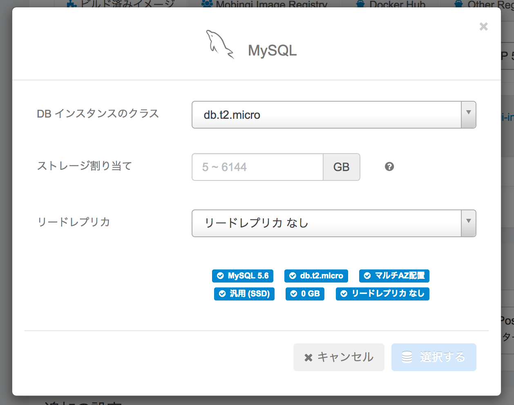
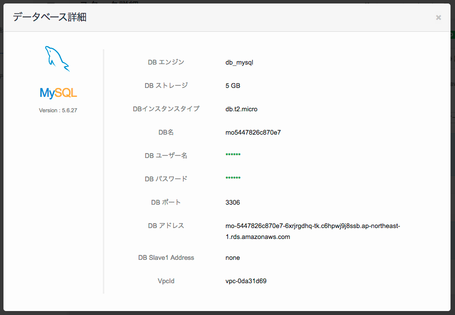
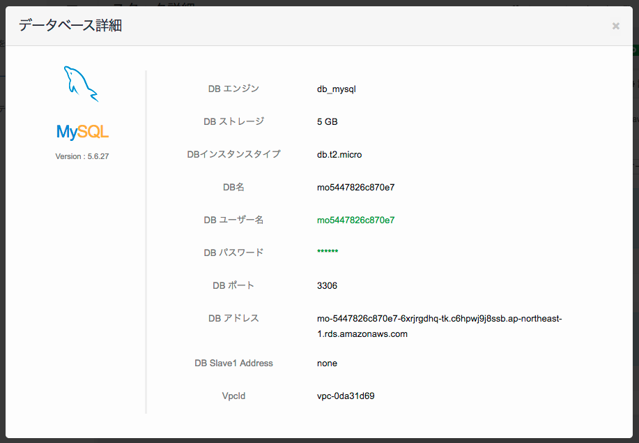

# RDSの使い方

mobingi ALMでは、アプリケーションスタック作成時、クラウドベンダーにAWSが選択されていた場合  
RDS（MySQL・PostgreSQL）をそのアプリケーションスタック内に実装する事が可能です。

## RDSの実装

アプリケーションスタック作成時にクラウドベンダーをAWSにします。

RDSの「MySQL」をクリックします。PostgreSQLでも基本的な設定は変わりません。

MySQLのDBインスタンス・ストレージ容量・リードレプリカの有無を決定し、右下の「選択する」をクリックします。

MySQLに値が設定されハイライトします。この状態で「アプリケーションの作成」をクリックすると、アプリケーションスタック内にMySQLが実装されます。

## RDSの詳細確認

スタック詳細のデータベース項目から、DBアドレス（Master）をクリックします。

RDS（MySQL・PostgreSQL）への接続情報が確認できます。

DBユーザ名・DBパスワード名は不可視となっています。クリックする事で確認できます。

