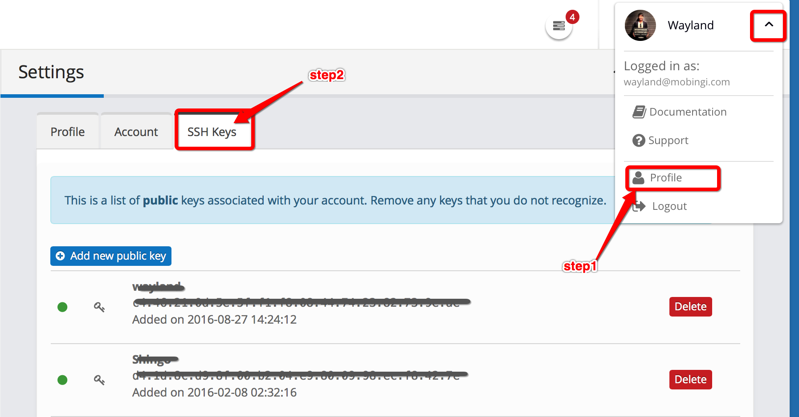

# SSH into your container


**Do not** use SSH to install software required for production. Servers should be able to go down at any time and be started at any time wi th no human intervention. If you need custom software installation, please refer to [this guide](https://docs2.mobingi.com/v/v2/guides-and-tutorials/others/ssh-into-your-container).  
SSH is provided in the rare case you need to go on an actual production container to debug and check when something cannot be reproduced or has gone horribly wrong.


## Creating a keypair

First of all you should have a key pair specific to you on your computer. In order to check if you have one, simply type `ls ~/.ssh` in your console.

```bash
ore-no-pc:test david$ ls ~/.ssh/
id_rsa		id_rsa.pub
```

As above, if you do not see id\_rsa and id\_rsa.pub, then you need to create one by using the `ssh-keygen`command:

```bash
ore-no-pc:test david$ ssh-keygen
Generating public/private rsa key pair.
Enter file in which to save the key (/Users/david/.ssh/id_rsa):
Enter passphrase (empty for no passphrase):
Enter same passphrase again:
Your identification has been saved in meow.
Your public key has been saved in meow.pub.
The key fingerprint is:
8d:b9:76:d5:24:b9:26:80:08:f0:e0:03:fc:1c:84:6e david@ore-no-pc.local
The key's randomart image is:
+--[ RSA 2048]----+
|=.+.             |
|                 |
|.o+ o            |
|                 |
|.                |
|         . +     |
|        o .      |
|       . .       |
|                 |
+-----------------+
```

Now you can simply run `ls ~/.ssh/` again to check that you have a key pair.

## Uploading your public key


In order to SSH into a machine you ONLY have to provide it with your **Public Key** or `id_rsa.pub`. This will allow the machine to identify you. **NEVER** transmit your Private Key `id_rsa` over the network.


Open your [Dashboard](https://console.mobingi.com/) and click on the Settings button on the top right, then click on SSH Keys tab.



Then, lick on the Add new public key button to add a new user key.

You will need to display your public key by typing `cat ~/.ssh/id_rsa.pub`

```bash
ore-no-pc:test david$ cat ~/.ssh/id_rsa.pubssh-rsa AAAAB3NzaC1yc2EAAAODAQABAAABAQDKfe6MTHhHY0OSjI31Yw5e7Kjd1gYPOTs1KU3dLnZrFfPvljYW3hCWMmpROqHYmwV/E4K+Tj+8ladawdawdadawdadawQBQGtQevrS+mCqoC9oPXFt/HEXQAgKfiYP4X73We9t/y0b+6ndgW1Prfl5kKycmN6eqT+MawdadwawdawdawdpJzawdawdFZuve85z+vQTa8HrHh6jTu7tilyH1zWAFkw2u8FenRof8C4akPj0GWRtfnQPjRMzx4wgr3CpTqdCxlCSzez/6cvEG4MQMXY7Xr/OrYki9caYTFPFVv2goFEqpPCnsowof2e0P david@ore-no-pc.local
```

```bash
dfdfdfsdf
```

