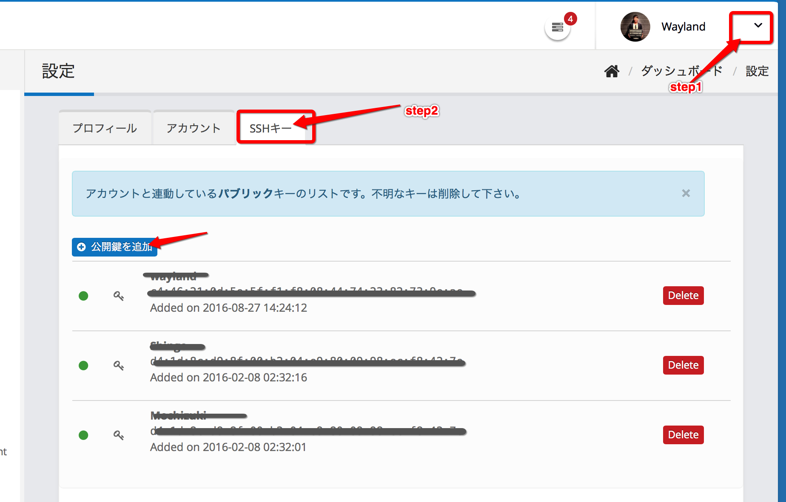
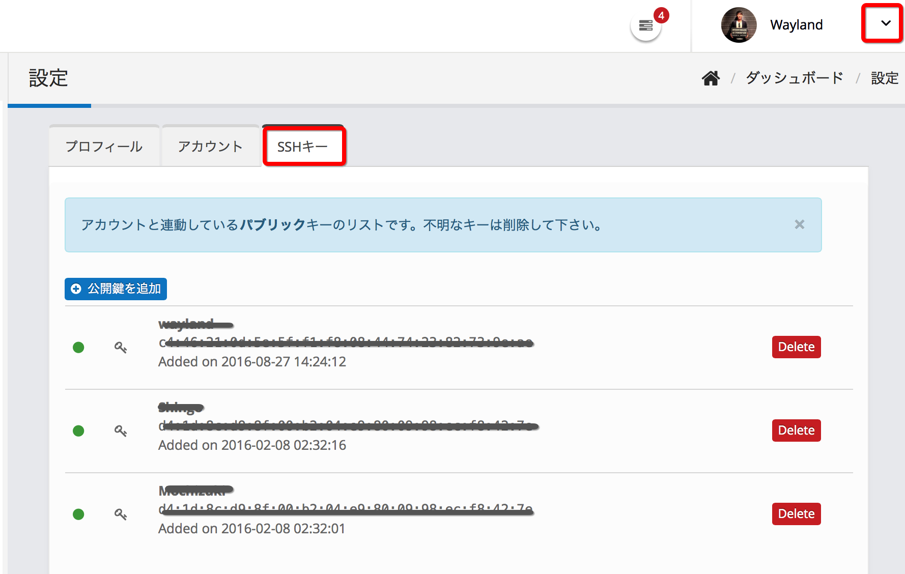
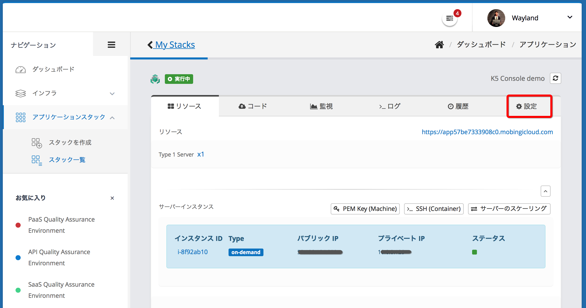
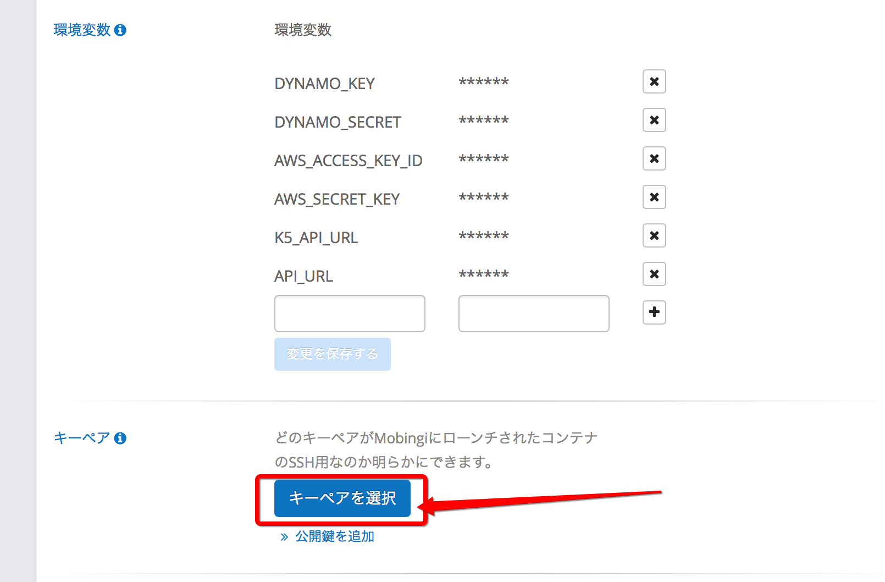
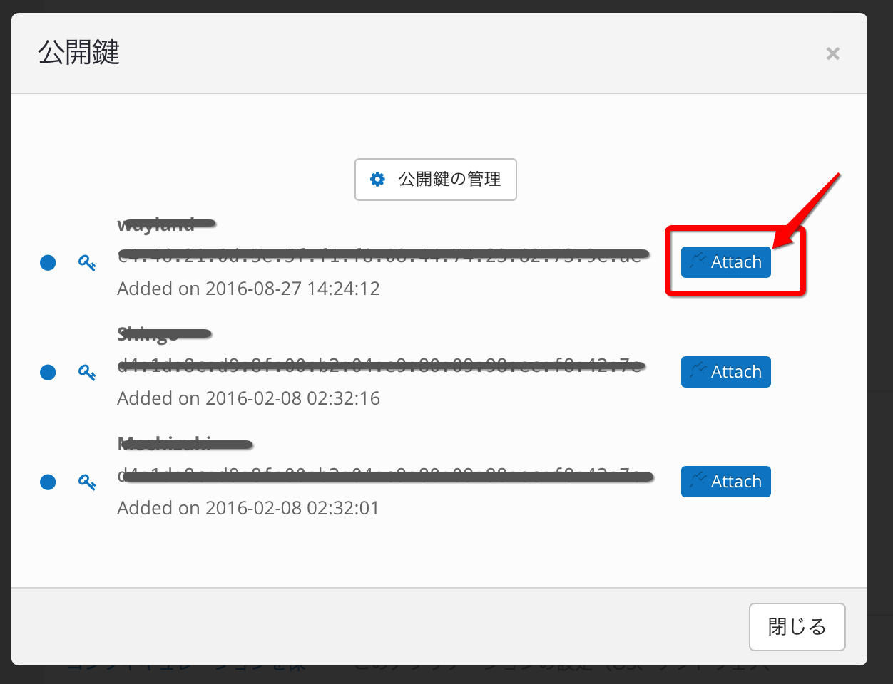
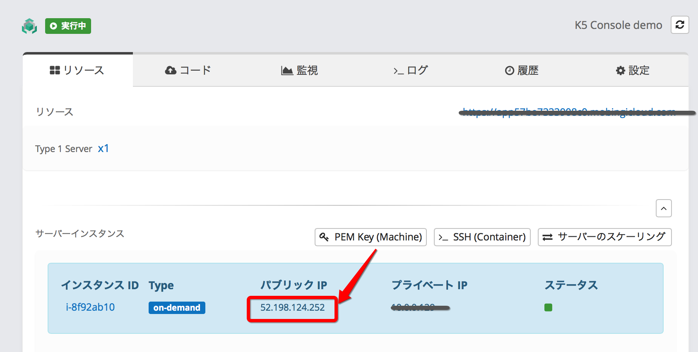
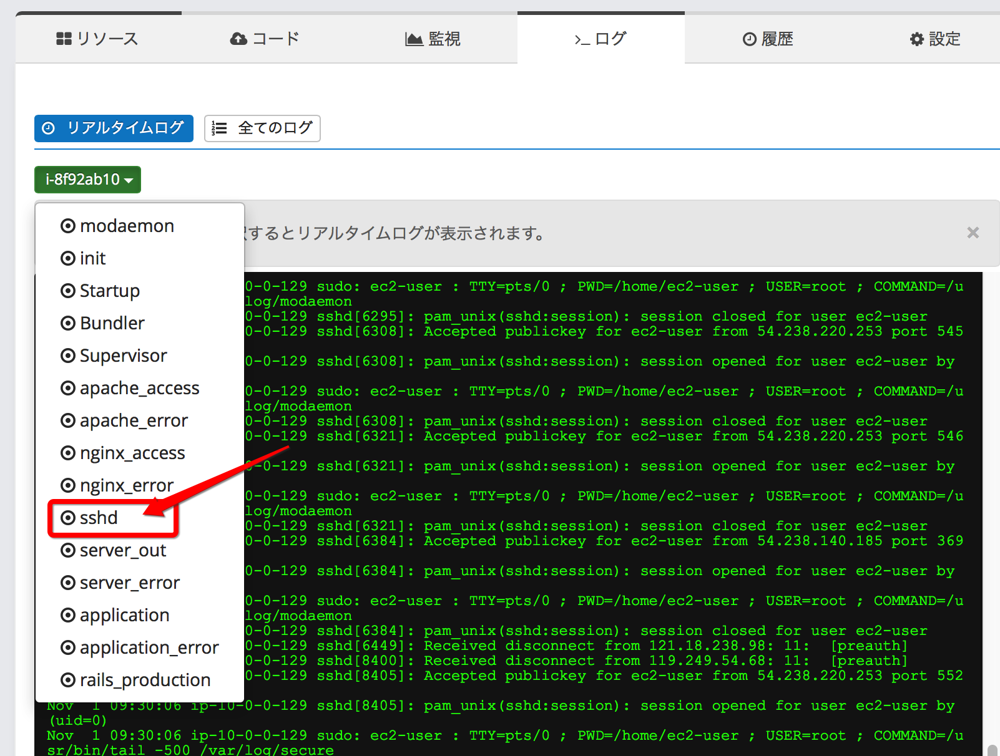

# コンテナにSSHでログインする


SSHでログインして行われた追加インストール作業や設定変更された値は**コードの自動デプロイ時などコンテナの入れ替え時に引き継がれず消えてしまいます。**ソフトウェアの追加インストールが必要な場合はこちらの[ガイド](https://docs.mobingi.com/official/tutorials/jp/custom_installation_script)をご参照いただいて追加インストールを行うか、アプリケーション環境に利用するDockerイメージにあらかじめ含めておいてください。  
このSSH機能は、デバッグや一時的な動作確認のために本番コンテナにアクセスしたい場合などに限ってご利用ください。


## キーペアの作成

まず始めに、お客様のコンピューター用のキーペアを作成します。すでにお持ちかどうか確認するためにコンソールで`ls ~/.ssh`と入力して確認することも可能です。

```bash
ore-no-pc:test david$ ls ~/.ssh/
id_rsa		id_rsa.pub
```

上記のように、id\_rsa や id\_rsa.pub が表示されない場合、`ssh-keygen`コマンドを使用しキーを作成してください。

```bash
ore-no-pc:test david$ ssh-keygen
Generating public/private rsa key pair.
Enter file in which to save the key (/Users/david/.ssh/id_rsa):
Enter passphrase (empty for no passphrase):
Enter same passphrase again:
Your identification has been saved in meow.
Your public key has been saved in meow.pub.
The key fingerprint is:
8d:b9:76:d5:24:b9:26:80:08:f0:e0:03:fc:1c:84:6e david@ore-no-pc.local
The key's randomart image is:
+--[ RSA 2048]----+
|=.+.             |
|                 |
|.o+ o            |
|                 |
|.                |
|         . +     |
|        o .      |
|       . .       |
|                 |
+-----------------+
```

再び`ls ~/.ssh/`を実行し、キーペアを取得したか確認してみましょう。

## 公開鍵を登録する


SSH公開鍵をマシンに設置するために、**既存の公開鍵**か上記で作成した`id_rsa.pub`のみを使用します。絶対に秘密鍵`id_rsa`を**送信しないでください。**


[ダッシュボード](https://console.mobingi.com/)を開き、右上にある設定をクリックし、SSHキータブをクリックしてください。



そして、パブリックキーを追加ボタンをクリックすると新しいユーザーキーが追加できます。

作成した公開鍵をテキストエディターで表示するか、コマンドラインで`cat ~/.ssh/id_rsa.pub`と打ち込むと内容が表示できます。

```bash
ore-no-pc:test david$ cat ~/.ssh/id_rsa.pub
ssh-rsa AAAAB3NzaC1yc... david@ore-no-pc.local
```

表示された公開鍵のボディ部（**ssh-rsa**で始まります）をコピーして公開鍵（Public Key）の欄にペーストします。キー名（Key Name）の欄にログインする際に使用したいユーザー名を入れるのを忘れないように注意してください。キー名欄は英数字、アンダーバーのみ有効です。スペースは使用できません。


ここまで完了したらアカウント内の公開鍵の一覧を確認しましょう。



## アプリケーションスタックに公開鍵情報を登録する

次はアプリケーション環境の設定ページに移動し、サーバーにパブリックキーを配置する作業です。



該当のアプリケーション環境の設定ページをスクロールしキーペアを選択ボタンをクリックしてください。



お客様が追加済みの公開鍵の一覧が表示されるので、Attachボタンをクリックしサーバーにキーを設置してください。



ログタブに移動し、サーバーの`moDaemon`ログをご覧ください。下記は一例です:

```text
[08/Jun/2015:19:25:37 +0900] Switching port forward from blue to green container
[08/Jun/2015:19:25:37 +0900] Adding user: My_office_Laptop
```

このように新しいコンテナが起動し、古いコンテナとの入れ替えが完了した旨の表示があれば、お客様のユーザーは正常にコンテナに追加されています。

## コンテナにSSHでログインする

まず、コンテナにSSHログインするために、インスタンスのIPアドレスを特定する必要があります。スタック詳細ページにてそれぞれのサーバーのIPアドレスが確認できます。



SSH のユーザ名（アプリケーションスタックへ登録したキーペアのキー名を使用します）、インスタンスの IP アドレスを指定し、以下のように SSH コマンドを実行することでコンテナへログイン出来ます。下記は一例です:

```bash
$ ssh My_office_Laptop@52.68.3.179
```

## SSHログイン履歴を確認する

認証ログを見れば、どのユーザーがいつサーバーにアクセスしたかを確認することができます。スタックログページの`ssh`をクリックするとマシンの認証ログの閲覧が可能です。



