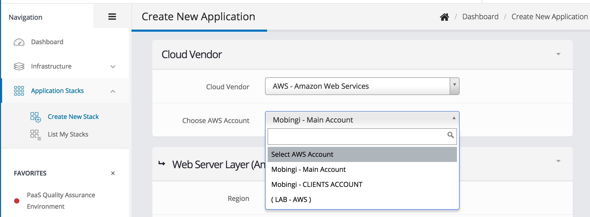
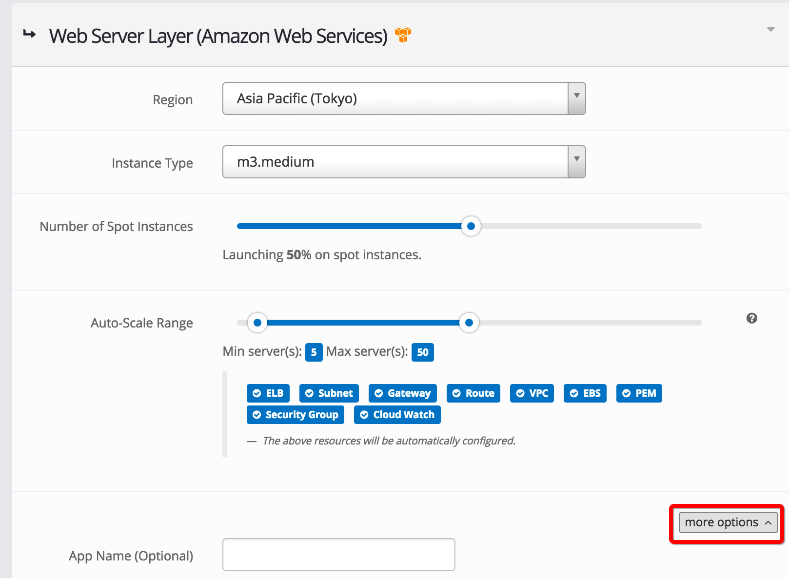
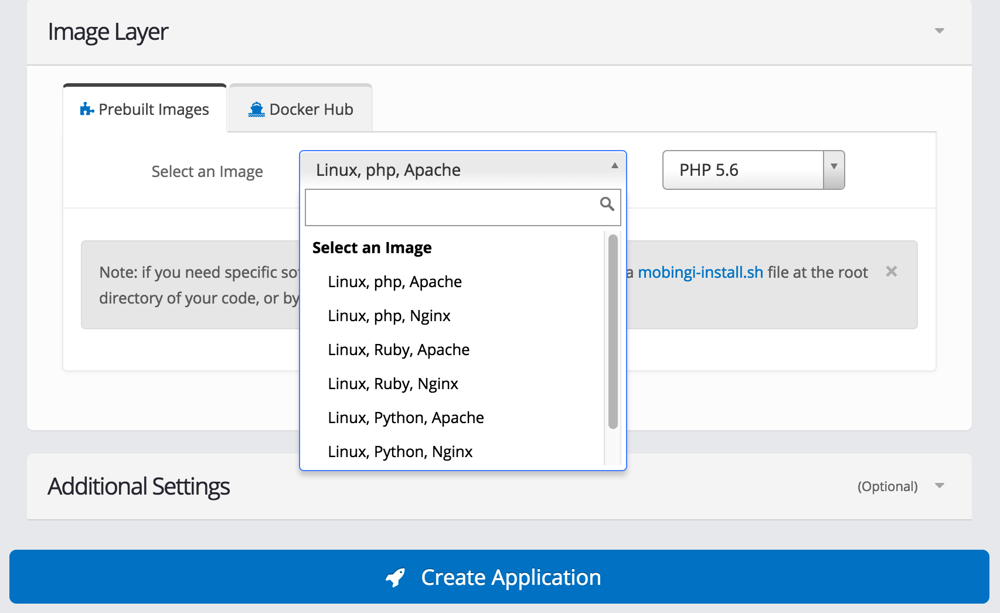

# スタックの作成

## アプリケーションスタックを作成する \(AWS\)

このページではモビンギの特徴であるアプリケーションの**"ライフサイクルマネジメント"**についてご説明しています。利用を開始するにあたり、まずはAWSアカウントをmobingi ALMに登録します。

### AWSアカウントの認証情報を登録する

[ダッシュボード](https://console.mobingi.com/)を開き、右上のドロップダウンより『一般設定』--&gt;『認証情報』--&gt;**『AWS』**をクリックしてください。

AWSのサーバー証明書の**アクセスキーID**と**シークレットアクセスキー**を入力。  
アクセスキーIDとシークレットアクセスキーの取得方法は[こちら](https://docs.mobingi.com/official/others/jp/get-accesskey)をご覧ください。  
モビンギはマルチアカウント対応なので複数のAWSアカウントが登録できます。

### Create application stack

Let's make your first application stack through mobingi ALM!

* Click**『Application Stacks』--&gt;『Create New Stack』**
* Choose AWS as cloud vendor.

* Choose Region.
* Select Instance type.
* You can define Number of Spot Instances by mouse dragging. By using spot instance, you can save 80% of EC2 cost maximum.
* Define Auto-Scale Range. Mobingi ALM software automatically creates ELB, Subnet, Networks, and other resources which are necessary.

* Choose Image Layer.
* By clicking 『Create Application』, the software will start creating your application stack.

