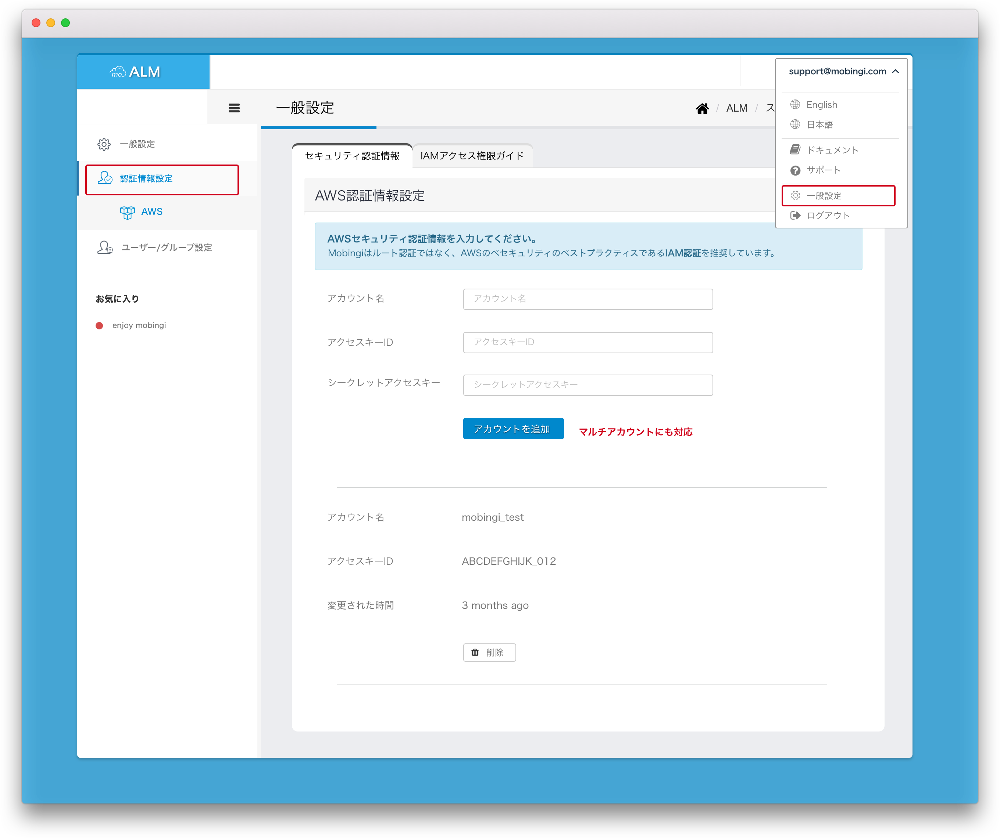
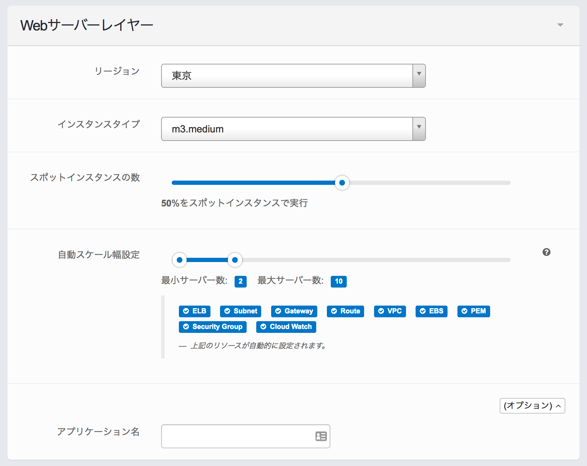
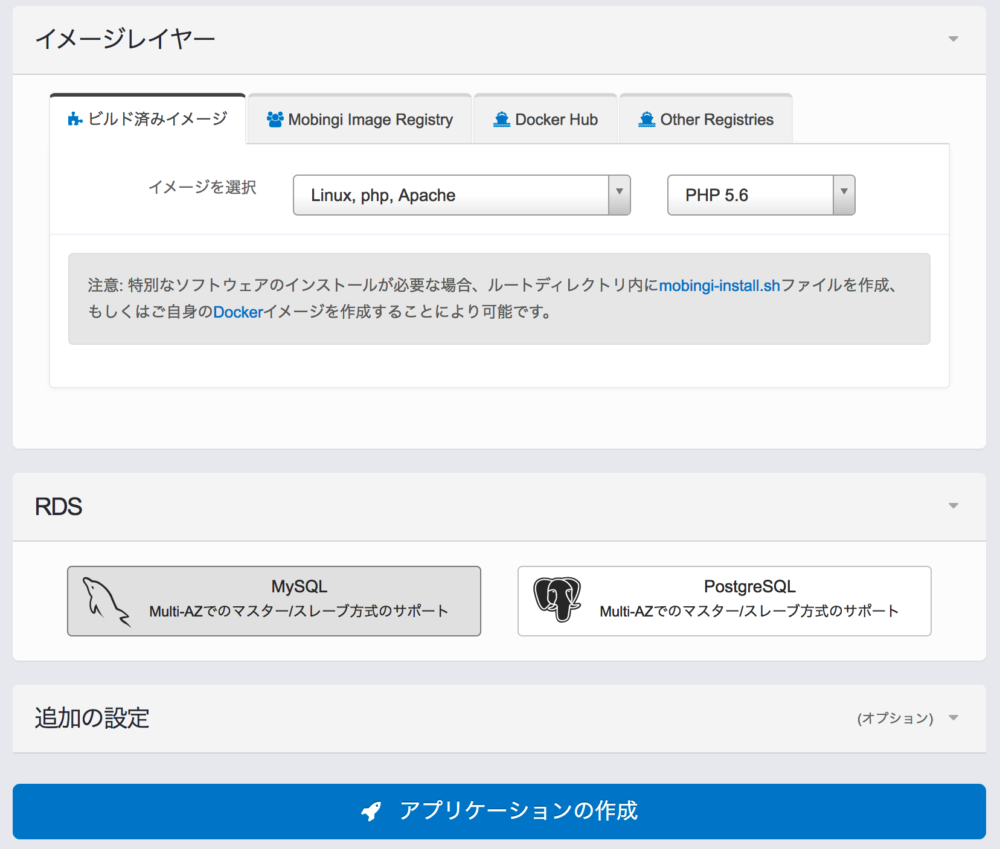

# スタックの作成

## アプリケーションスタックを作成する \(AWS\)

このページではモビンギの特徴であるアプリケーションの**"ライフサイクルマネジメント"**についてご説明しています。利用を開始するにあたり、まずはAWSアカウントをmobingi ALMに登録します。

### AWSアカウントの認証情報を登録する

[ダッシュボード](https://console.mobingi.com/)を開き、右上のドロップダウンより『一般設定』--&gt;『認証情報』--&gt;**『AWS』**をクリックしてください。

AWSのサーバー証明書の**アクセスキーID**と**シークレットアクセスキー**を入力。  
アクセスキーIDとシークレットアクセスキーの取得方法は[こちら](https://docs.mobingi.com/official/others/jp/get-accesskey)をご覧ください。  
モビンギはマルチアカウント対応なので複数のAWSアカウントが登録できます。

### アプリケーションを作成する

早速mobingi ALMを使ってご自分のAWSアカウントにアプリケーションを実行してみましょう。

* サイドバーの**『アプリケーションスタック』--&gt;『スタックの作成』**をクリック
* クラウドベンダーは『AWS』を選択

* リージョンを選択
* インスタンスタイプを選択
* スポットインスタンスの割合を選択。スポットインスタンスを選択することで最大80%インスタンスの料金を削減できます。
* 自動スケール幅を設定。ELB,Subnet...などの表示されているリソースはモビンギにより自動的に用意されます。

* 希望のイメージを選択
* RDSを利用する場合は選択。RDSのより詳しい利用方法は[こちら](https://docs.mobingi.com/official/guide/jp/rds)から。
* 『アプリケーションの作成』をクリックすると作成が開始されます。

