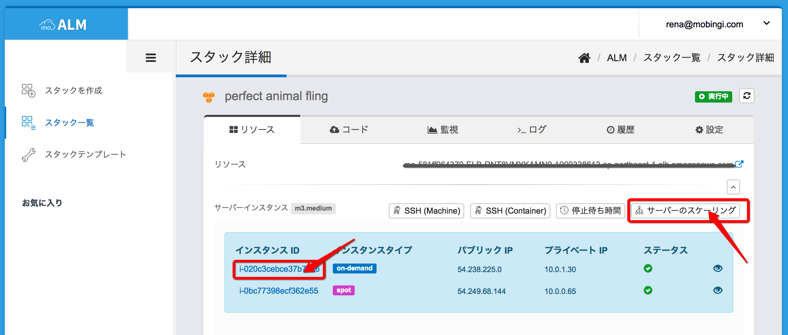
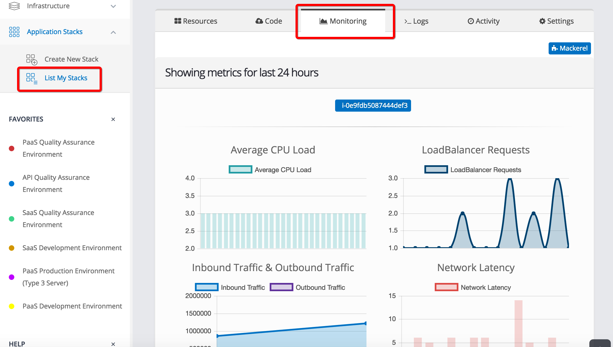
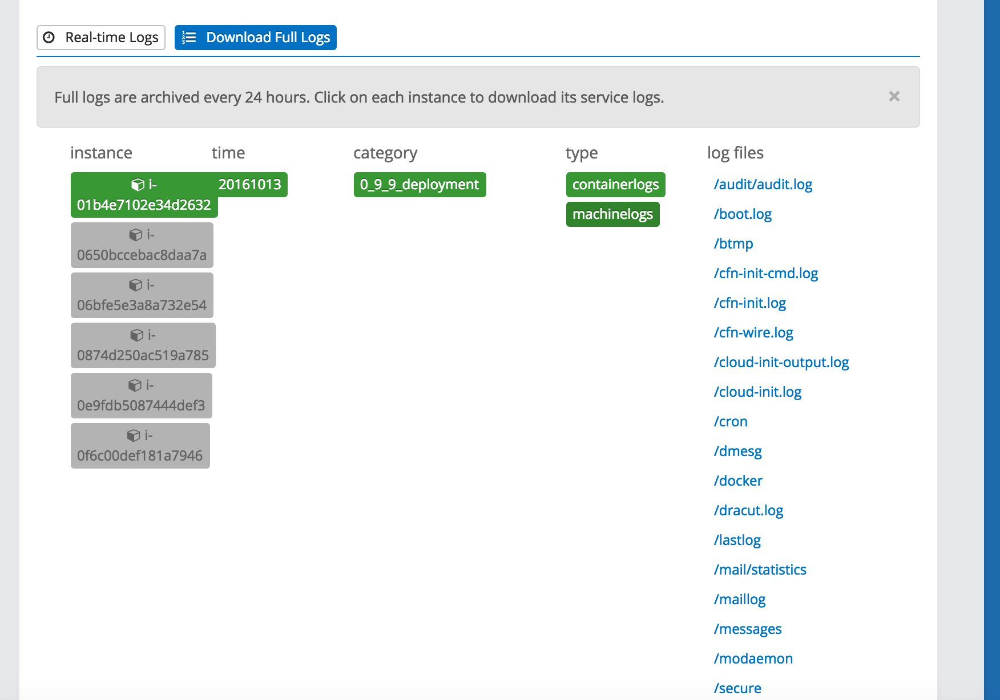
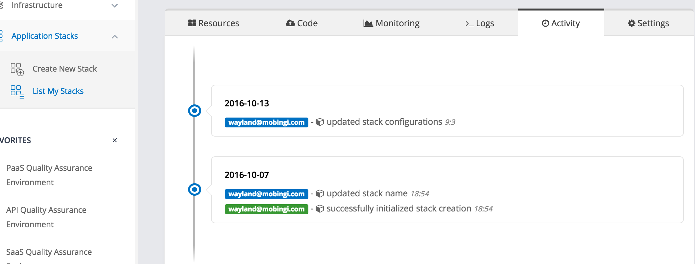
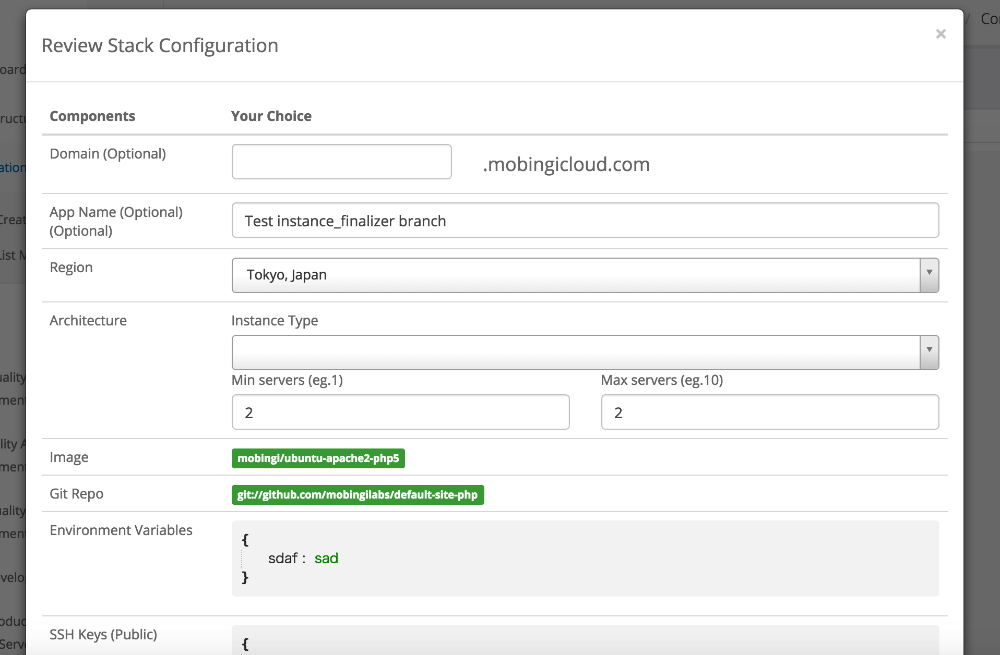

# スタックの管理

## [アプリケーションスタックを管理する](https://docs.mobingi.com/official/guide/jp/manage#sec1)

mobingi ALMはアプリケーションスタックの作成のみでなく、運用に役立つ様々な機能が備わっています。メニューの『スタック一覧』--&gt; 対象のスタック --&gt; インスタンスID をクリックするとインスタンスの情報が表示されます。

更に、先ほどの対象スタックページの右にある『サーバーのスケーリング』から『オートスケール幅』や『リザーブドインスタンスの割合』のライブアップデートが可能です。

## Deploy code from Git repository

Deploy code is deadly fast. Click Code tab, then setup below.

* Enter Repo name [\(What is Repo name?\)](https://docs.mobingi.com/official/guide/reponame/jp)
* Branch name.
* If it's a Private repo, need to put Secret key [\(Hot to create Deploy key?\)](https://docs.mobingi.com/official/faq/deploykey/jp)
* If you don't use GitHub, you can upload files from "Upload".

After Successfully connecting, by typing "git push" the code will automatically affect to every server in that stack.

## Monitoring

Mobingi Enterprise has so many useful features which help customers' operation. By clicking『List My Stacks』--&gt;『Monitoring』tab, you can check the detail information of each instance.

## Logs

You can get Machine logs through Mobingi which is very good for auditing. Click『List My Stacks』--&gt;『Logging』tab, then you can check Realtime Log and downloadable Lifetime Logs as well. The Lifetime Logs will be stored from the moment you deploy applications.

## Activity

Manager can see which user did what from『List My Stacks』--&gt;『Activity』.

## Settings

About detail setting, you can change from『List My Stacks』--&gt;『Setting』.

You can live update Environment Variables and keypairs. Also easily save application stacks' configurations.

By clicking once, you can launch new stacks with saved configurations.

If you want to delete application, just click『Delete Application』.

