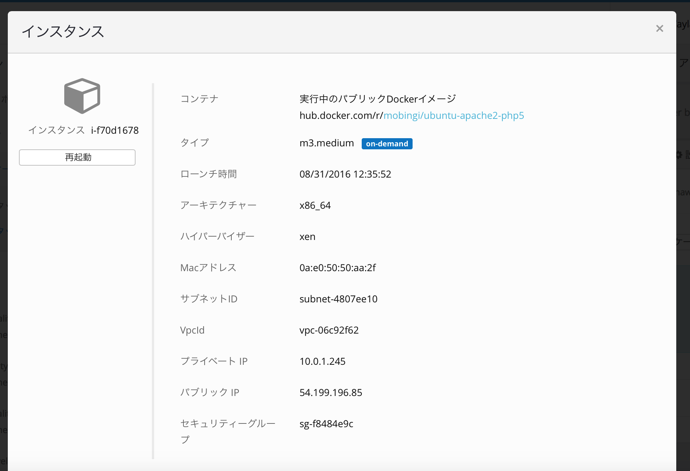
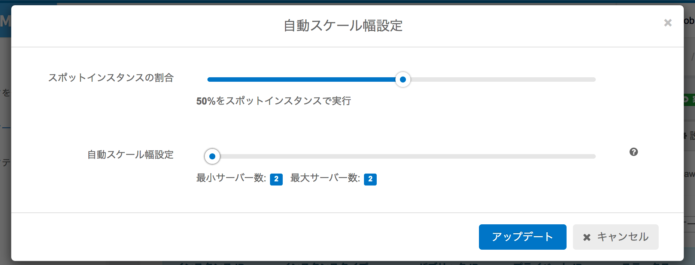
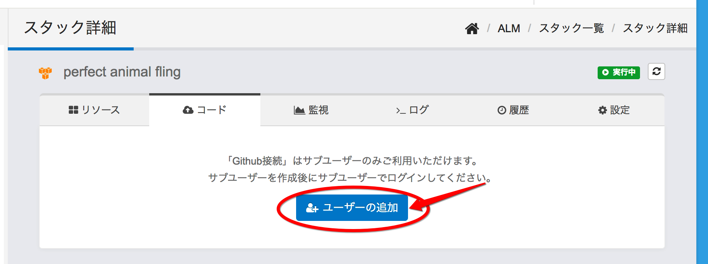
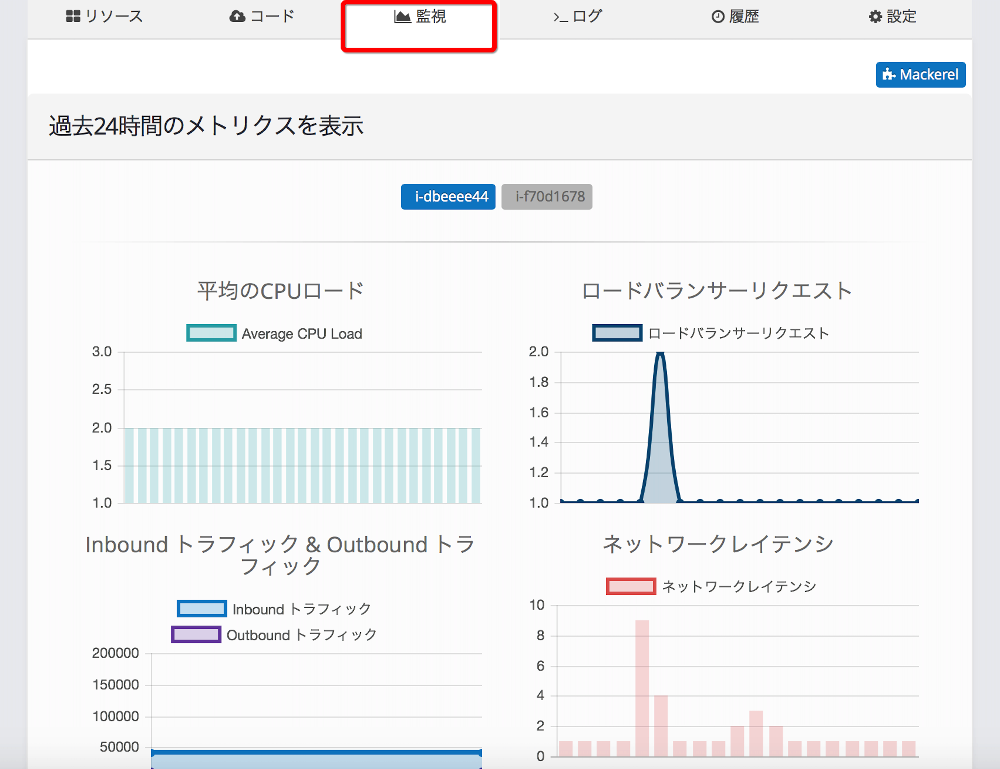
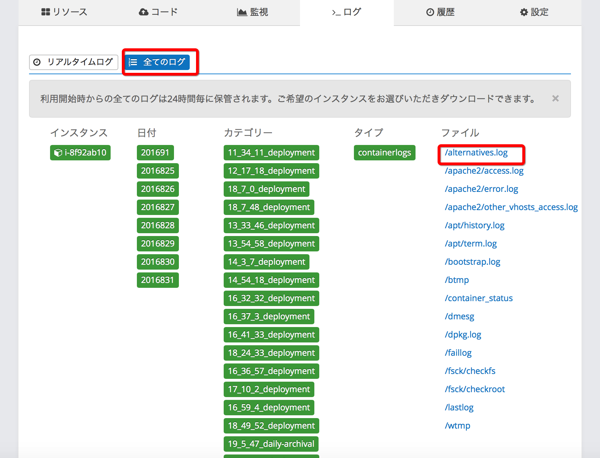
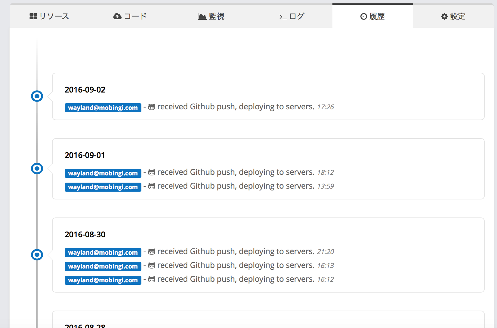
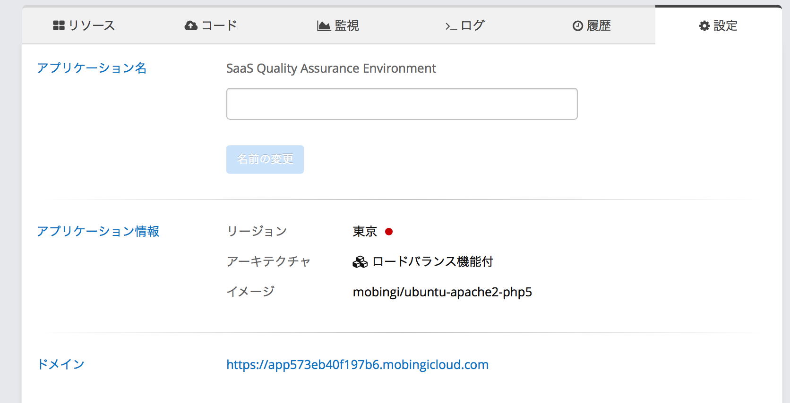
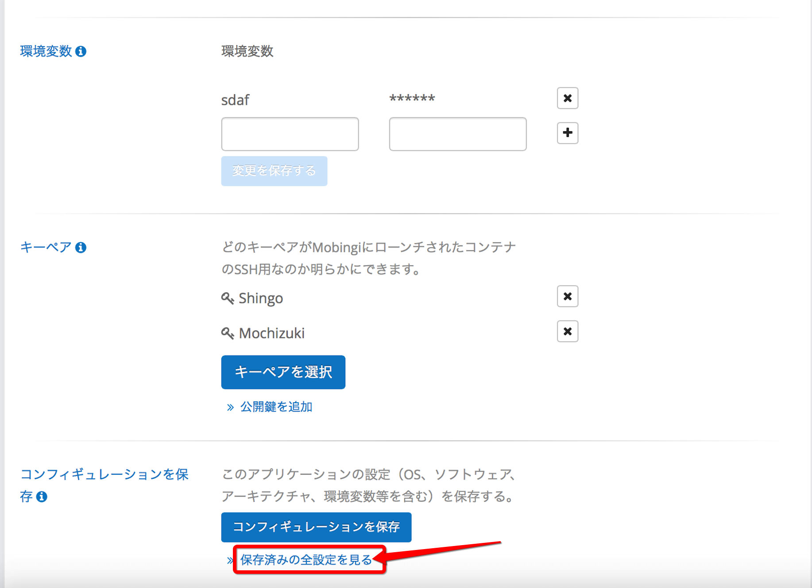
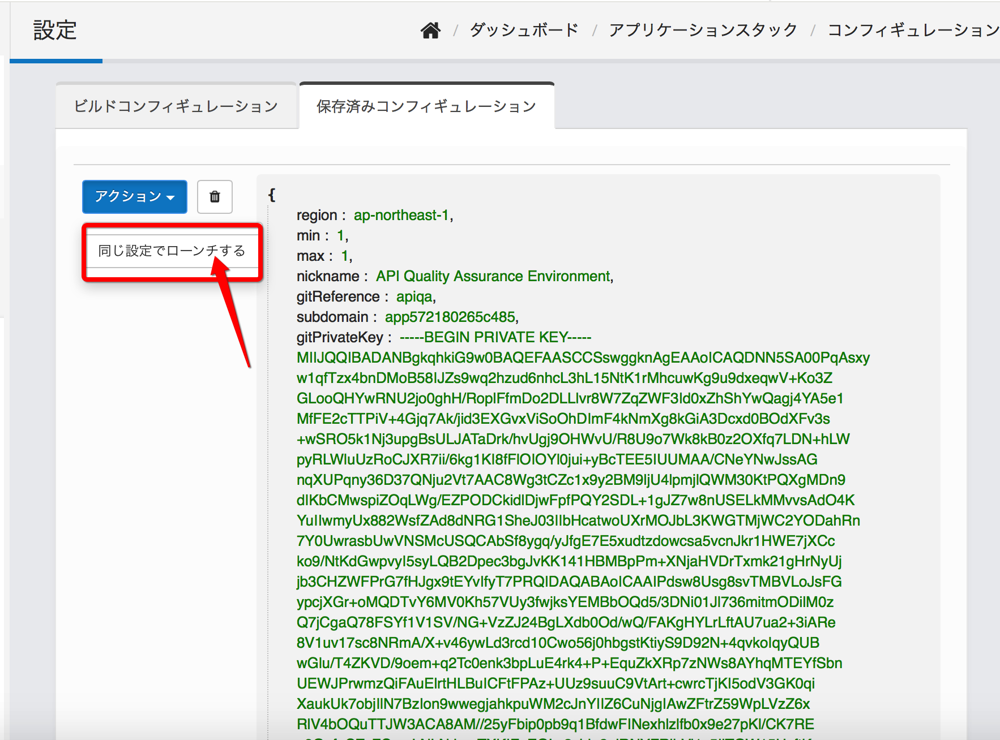
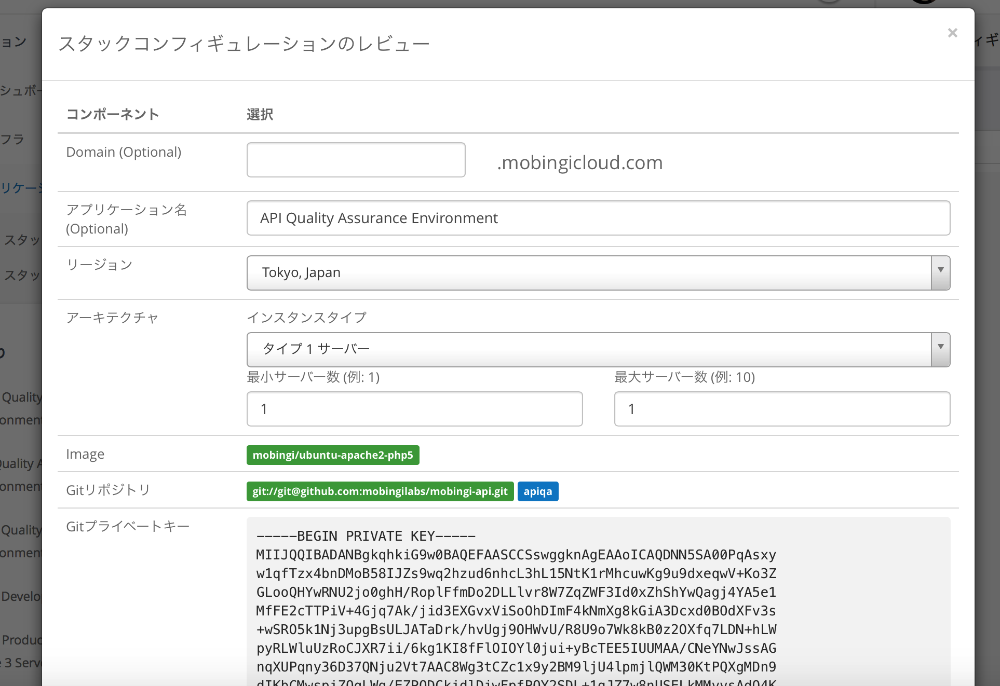

# スタックの管理

## アプリケーションスタックを管理する

mobingi ALMはアプリケーションスタックの作成のみでなく、運用に役立つ様々な機能が備わっています。メニューの『スタック一覧』--&gt; 対象のスタック --&gt; インスタンスID をクリックするとインスタンスの情報が表示されます。

更に、先ほどの対象スタックページの右にある『サーバーのスケーリング』から『オートスケール幅』や『リザーブドインスタンスの割合』のライブアップデートが可能です。

## Gitリポジトリからコードデプロイ

コードのデプロイはすばやく簡単に行えます。メニューの全てのスタックをクリック、コードタブをクリックし以下を設定します。

* リポジトリ名を入力します \(フォーマット\)
* ブランチ名を入力します
* プライベートGitリポジトリの場合は秘密鍵を指定します\([方法](https://docs.mobingi.com/official/others/jp/deploykey)\)
* GitHub以外を利用する場合は、Uploadよりファイルをアップロードします。

コードのデプロイはサブユーザーのみ可能です。メインユーザーをご利用の方は表示ボタンよりサブユーザーを作成し、ログイン後Github接続がご利用いただけます。

接続が完了すればターミナルからのgit pushでスタック内の全サーバーに自動で変更が適用されます。

## 監視

mobingi ALMは１つのダッシュボードに様々な機能が備わっています。   
『スタック一覧』--&gt;『監視』タブでインスタンスごとの必要情報が閲覧できます。

## ログ

監査などに役立つマシンログもクリックで取得できます。   
『スタック一覧』--&gt;『ログ』タブでインスタンスごとの豊富な種類のリアルタイムのログが閲覧できます。

## 履歴

『スタック一覧』--&gt;『履歴』タブでどのユーザーが何をしたか、時系列ごとに閲覧が可能です。

## 設定

『スタック一覧』--&gt;『設定』タブから各種設定が可能です。

環境変数やキーペアのリアルタイムでの追加、更にはアプリケーションスタックの設定が保存できます。

保存済みの設定を利用し新しいスタックをワンクリックで作成できます。

アプリケーション環境を削除する場合は、『削除する』をクリックすることで削除できます。

