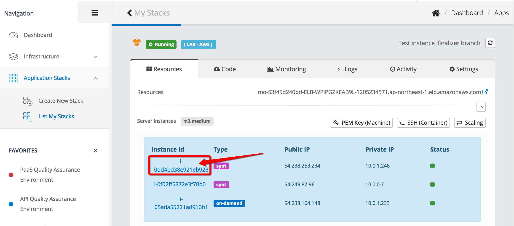
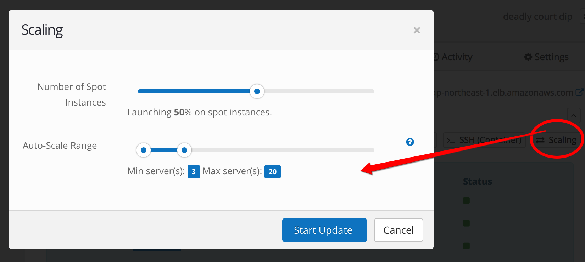
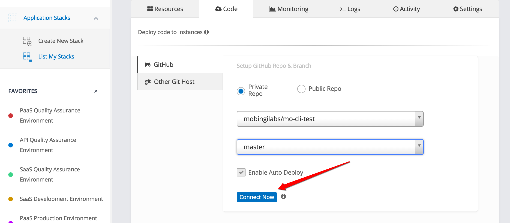
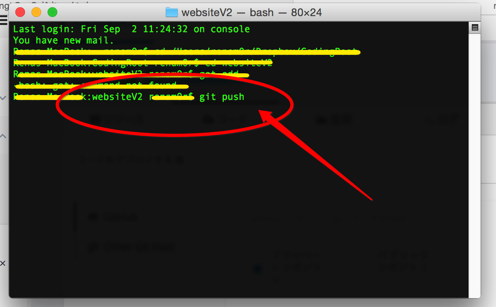

# Manage stack

Mobingi Enterprise not only create application stacks, but also can easily manage them. By using Mobingi, user don't need to monitor public cloud console. Mobingi console fully cover that parts.

You can check instance information from『List My Stacks』--&gt; Stack you want to check --&gt; Instance ID.

Additionally, by clicking『Scaling』, you can live update "Number of Spot Instacnces" and "Auto-Scale Range".

## Deploy code from Git repository

Deploy code is deadly fast. Click Code tab, then setup below.

* Enter Repo name [\(What is Repo name?\)](https://docs.mobingi.com/official/guide/reponame/jp)
* Branch name.
* If it's a Private repo, need to put Secret key [\(Hot to create Deploy key?\)](https://docs.mobingi.com/official/faq/deploykey/jp)
* If you don't use GitHub, you can upload files from "Upload".

After Successfully connecting, by typing "git push" the code will automatically affect to every server in that stack.

