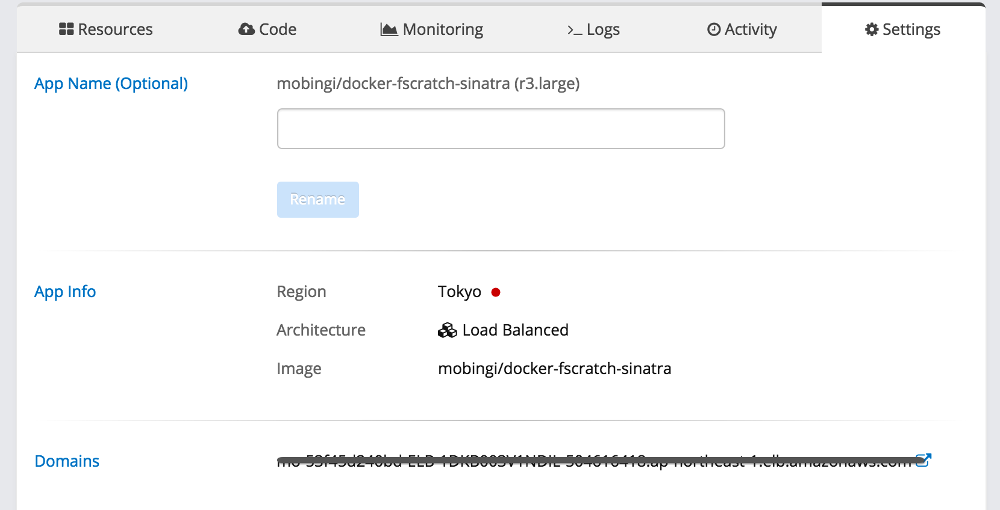
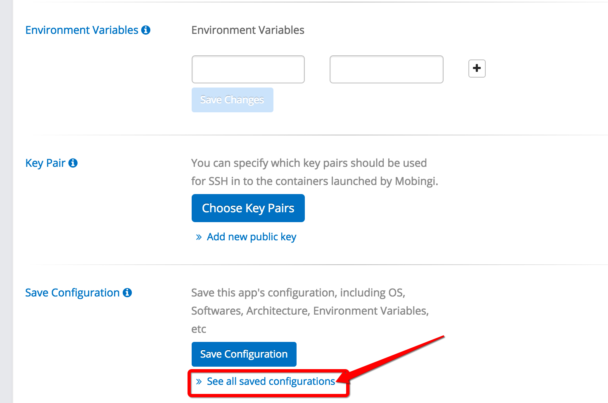
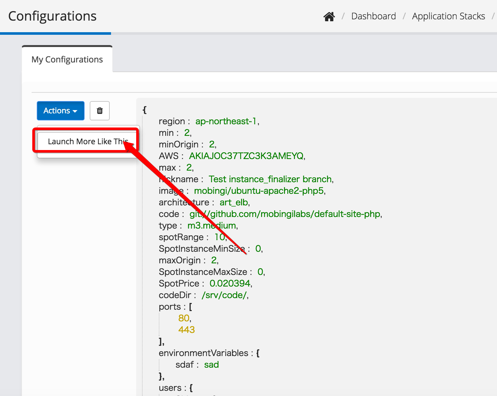
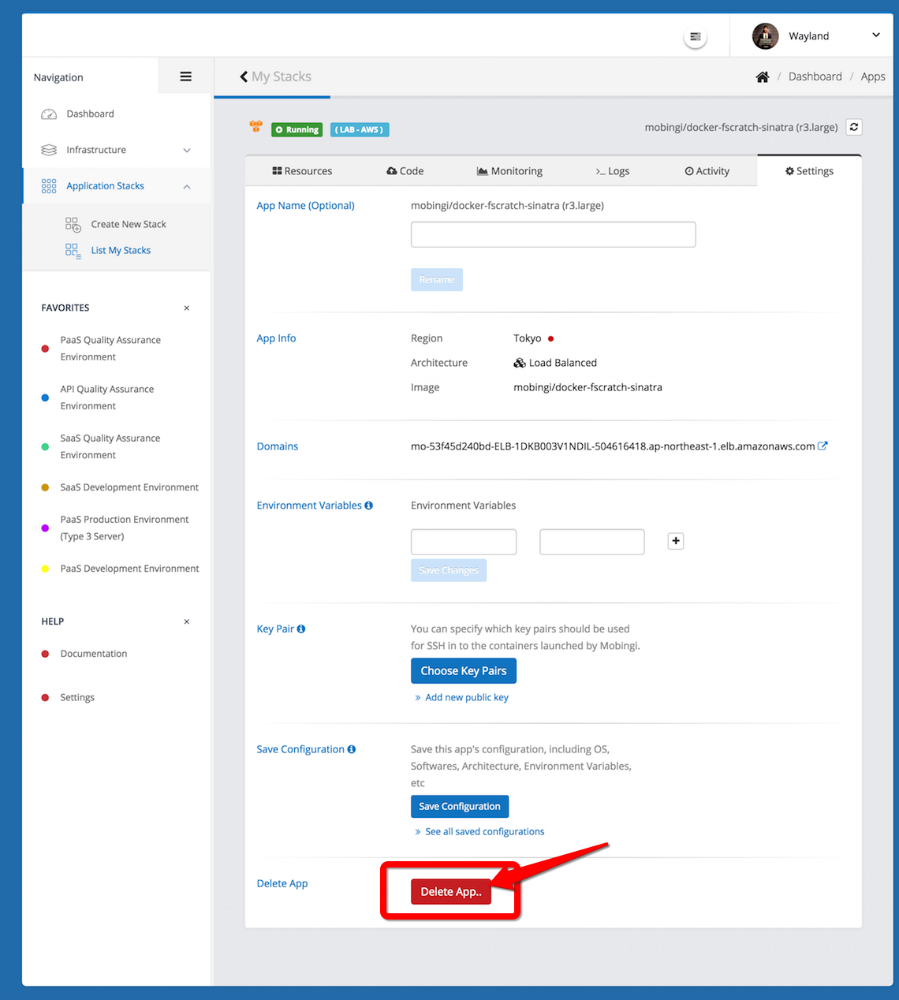

# スタックの管理

## Managing your stack

Mobingi Enterprise not only create application stacks, but also can easily manage them. By using Mobingi, user don't need to monitor public cloud console. Mobingi console fully cover that parts.

You can check instance information from『List My Stacks』--&gt; Stack you want to check --&gt; Instance ID.

Additionally, by clicking『Scaling』, you can live update "Number of Spot Instacnces" and "Auto-Scale Range".

## Deploy code from Git repository

Deploy code is deadly fast. Click Code tab, then setup below.

* Enter Repo name [\(What is Repo name?\)](https://docs.mobingi.com/official/guide/reponame/jp)
* Branch name.
* If it's a Private repo, need to put Secret key [\(Hot to create Deploy key?\)](https://docs.mobingi.com/official/faq/deploykey/jp)
* If you don't use GitHub, you can upload files from "Upload".

After Successfully connecting, by typing "git push" the code will automatically affect to every server in that stack.

## Monitoring

Mobingi Enterprise has so many useful features which help customers' operation. By clicking『List My Stacks』--&gt;『Monitoring』tab, you can check the detail information of each instance.

## Logs

You can get Machine logs through Mobingi which is very good for auditing. Click『List My Stacks』--&gt;『Logging』tab, then you can check Realtime Log and downloadable Lifetime Logs as well. The Lifetime Logs will be stored from the moment you deploy applications.

## Activity

Manager can see which user did what from『List My Stacks』--&gt;『Activity』.

## Settings

About detail setting, you can change from『List My Stacks』--&gt;『Setting』.

You can live update Environment Variables and keypairs. Also easily save application stacks' configurations.

By clicking once, you can launch new stacks with saved configurations.

If you want to delete application, just click『Delete Application』.

