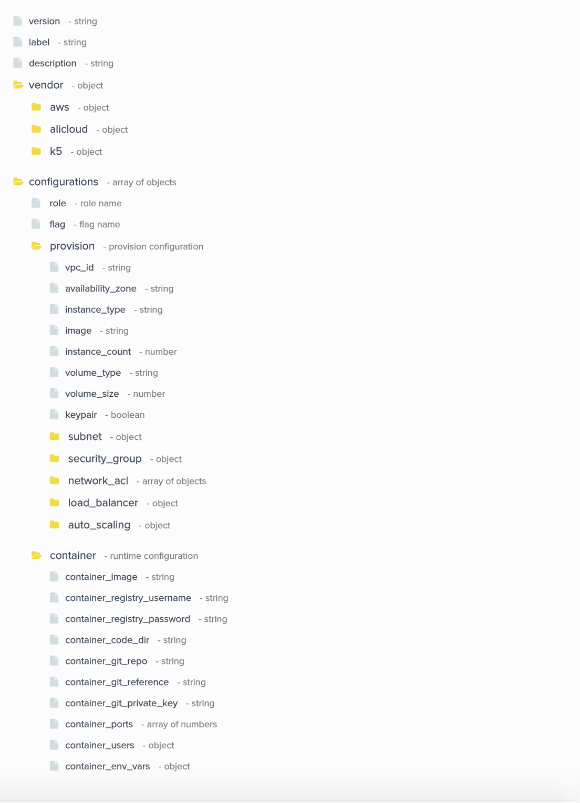

# Working with ALM Templates

## Alm-template Formats {#template-formats}

Alm-template is designed in **Json** format. You can also write your template in Yaml format and then convert it into json file when you deploy your stacks on ALM UI \(or through CLI, API\).

_Official yaml format support is in-progress_

## Alm-template Components {#template-components}

Alm-template top-level components consist of `version`, `label`, `description`, `vendor`, `configurations`.

### - version {#template-components-version}

The version of Alm-template release.

This value is always _2017-03-03_.

### - label {#template-components-label}

The label of the Alm-template.

You can use this section to mark the labels for each of your alm-template versions. This is useful when you update your template.

This value can be empty, and you can write up to 64 characters in length.

### - description {#template-components-description}

The description of the Alm-template.

You can use this section to describe the purpose of the alm-template, _for example: production app stack_.

This value can be empty, and you can write up to 255 characters in length.

### - vendor {#template-components-vendor}

The cloud platform vendor of which the template will be deployed to.

You need to specify the vendor in every alm-template you write, and can only specify one vendor at a time.

### - configurations {#template-components-configurations}

The configurations of the stack which Alm-template about to deploy.

In the configurations section, you specify one or multiple configuration layers of your application's provision and container runtime settings.

Inside each layer, there are four sections you need to specify:

* **role**

  The "role" of which the stack layer defines to.

  You deploy multiple layers within one Alm-template, for example two _web_ layers, one _bastion_ layer and one _database_ layer. The current available role names:

  * `web`
  * `bastion`

* **flag**

  The unique identifier of each layer.

  You must specify the _flag_ name for each configuration layer. The value must between 4 to 18 characters in length and contains only alphanumeric characters.

* **provision**

  The infrastructure provisioning configurations.

  For more information on _provision_ section, please refer to [ALM Template Reference guide](https://docs2.mobingi.com/mobingi-alm/alm-template/alm-template-reference).

* **container**

  The software runtime configurations _\(defined as docker images\)_ and code deployment requirement for each instance node.

  For more information on _container_ section, please refer to [ALM Template Reference guide](https://docs2.mobingi.com/mobingi-alm/alm-template/alm-template-reference).

## Alm-template Structure {#template-structure}

Below is a tree view of all possible components within an alm-template.

The following structure is not a working demo template, but rather to explain all possible key names that may contain in the template body.

For Alm-template examples, please refer to [Example ALM Templates](https://docs2.mobingi.com/mobingi-alm/alm-template/example-alm-templates).

