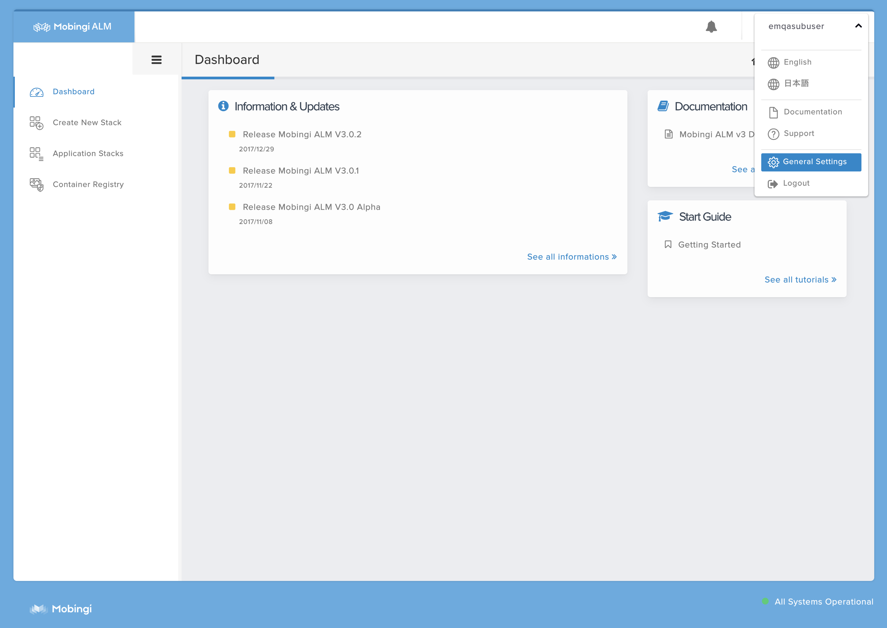
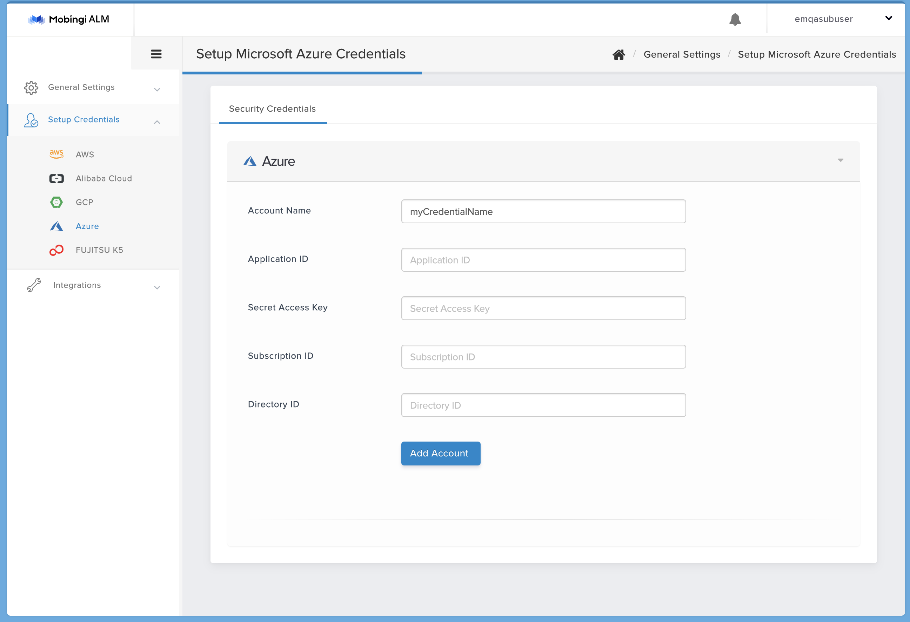

# Adding Azure account


To complete the instructions, you’ll need an Azure subscription. If you don’t already have one, you can sign up for an account [here](https://azure.microsoft.com/ja-jp/).


Microsoft Azure requires the credentials below to allow access to specific Azure resources.

1. Application ID
2. Secret Access key
3. Subscription ID
4. Directory ID

As a prerequisite, you must have sufficient permissions in both your Azure Active Directory and your Azure subscription. Specifically, you must be able to create an app in the Active Directory, and assign a role to the service principal.[\(Check Permission\)](https://docs.microsoft.com/en-us/azure/azure-resource-manager/resource-group-create-service-principal-portal#required-permissions)

## Using [Azure portal](https://portal.azure.com)  to create necessary credentials


If you already have  the _Application ID_, _Secret Access key_, _Subscription ID_, _Directory ID_, you can

skip to [**Adding Azure credential to your ALM account**](adding-azure-account.md#adding-azure-credential-to-your-alm-account) section ``


● [Create an Azure Active Directory application](https://docs.microsoft.com/en-us/azure/azure-resource-manager/resource-group-create-service-principal-portal#create-an-azure-active-directory-application)

● [Get Created Application ID and Add authentication key](https://docs.microsoft.com/en-us/azure/azure-resource-manager/resource-group-create-service-principal-portal#create-an-azure-active-directory-application)

● [Get Tenant ID\(Your tenant ID is your Directory ID\)](https://docs.microsoft.com/en-us/azure/azure-resource-manager/resource-group-create-service-principal-portal#get-tenant-id)

● [Assign application to role/subscription](https://docs.microsoft.com/en-us/azure/azure-resource-manager/resource-group-create-service-principal-portal#assign-application-to-role)

## Adding Azure credential to your ALM account


If you do not have yet an ALM account, you can sign up [here](https://mobingi.com/products/alm/pricing?hsCtaTracking=83291ee6-f70a-486a-909c-ed2bcca0629b%7C7cb2af36-bc9f-49f1-8e3f-f3848b2c5295) or [contact us](https://pages.mobingi.com/form-general?hsCtaTracking=0f1d2eb6-a1fc-4c4b-ab8e-934ffd3e8e94%7C504bc5ea-bcd0-4ae1-ba28-a6ec174cb93a).


1. After logging-in to your [Mobingi ALM](https://alm.mobingi.com/login) account, in the upper right of the page, click your `username` and then `General Settings`

2. In the left side-menu, click `Setup Credentials` and select `Azure`

3. Enter your preferred account name and the `Application ID`, `Secret Access Key`, `Subscription ID`, `Directory ID` you created in the _**Using Azure portal to create necessary credentials**_ section and click _**Add Account**_ button


Your credential is added at the bottom of the page.


