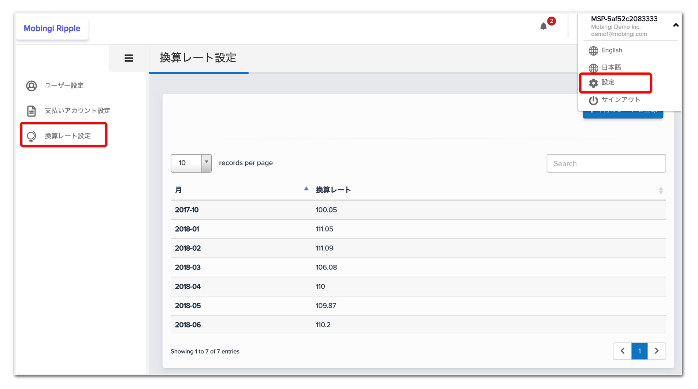
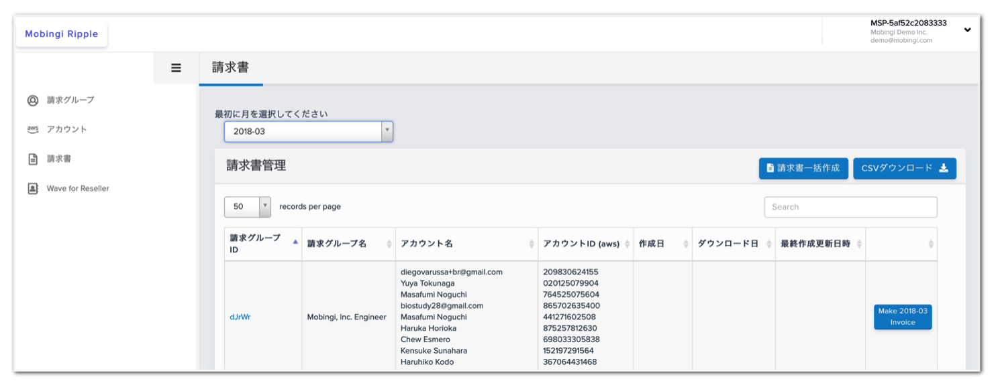
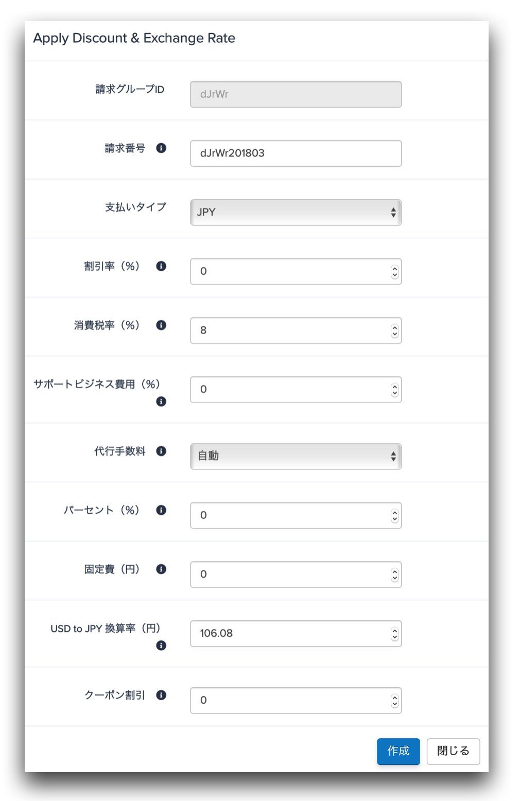
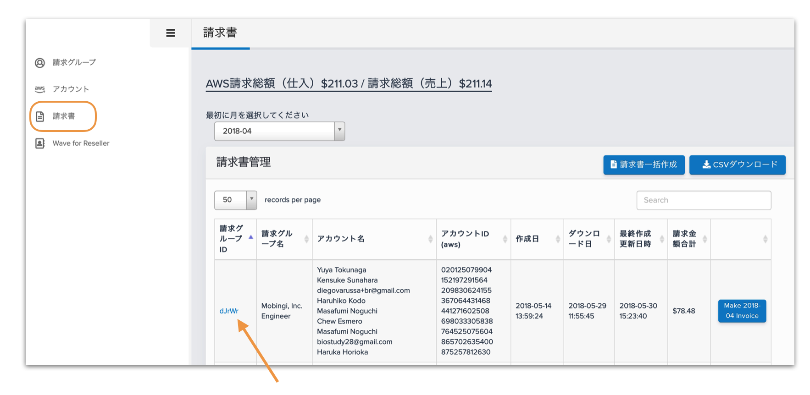
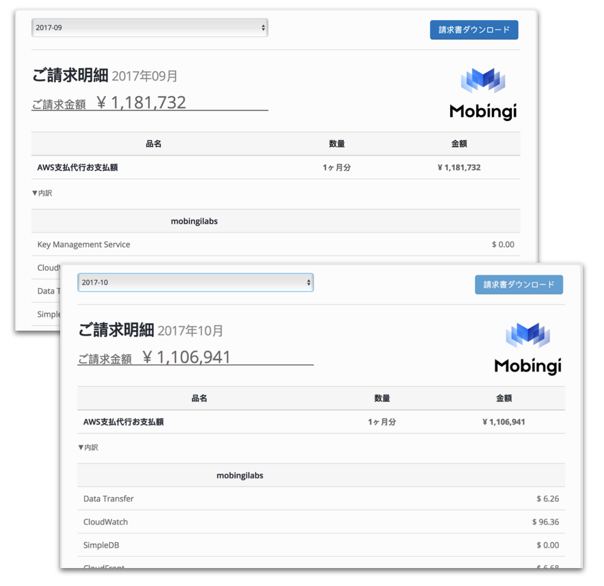
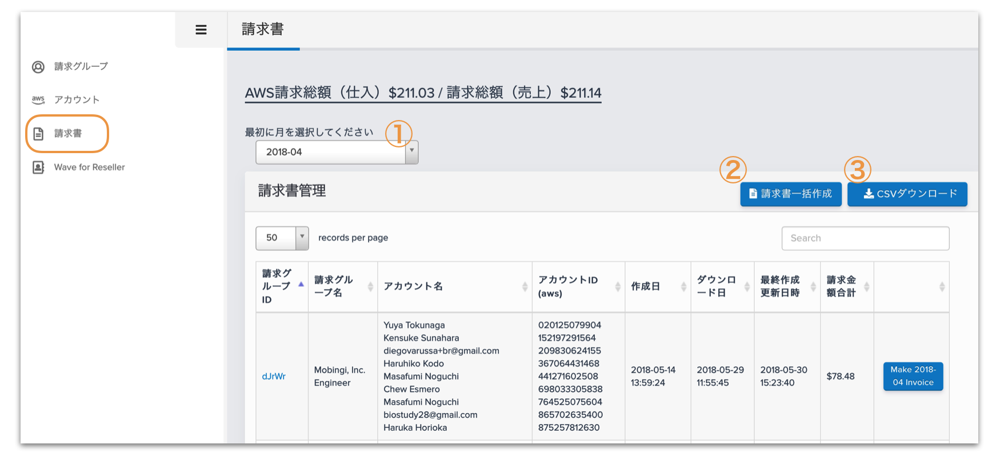
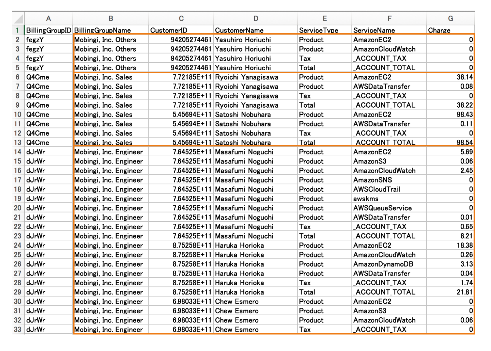

# 請求書を発行する

[※ 請求書発行する前に、請求データ確定のご連絡と集計作業が必要です。](https://docs.mobingi.com/~/drafts/-LI4AaN4Frv--_hbAXgG/primary/v/ripple/mobingi-ripple/mobingi-ripple-gai-yao#dashboard)

## 1. 為替レートを登録する

まずは今月分の為替レートを設定しましょう。

1. 画面右上のドロップダウンメニューより「設定」を選択。
2. 左メニューの「換算レート設定」を選択し今月分のレートを設定。

レートを再設定すると当月分のレートが上書きされます。過去のデータを変更することはできません。

メニューの「ユーザー設定」より下記の請求書設定ができます。

* 端数丸め処理：切り捨て、切り上げ、四捨五入 日本円にしたときの小数点以下の扱いを設定できます。 
* 消費税集約レベル：サービス単位、アカウント単位、請求グループ単位 CSVをダウンロードする際の消費税の計算レベルの設定です。 

## 2. Rippleで請求書を発行する

1. 請求対象の利用月を選択する。
2. 請求グループごとに`Make Invoice`をクリック。

これらの値は請求グループに事前に設定することができます。 事前設定内容を、請求書発行時に都度上書きすることが可能です。

* 支払タイプ
* 割引率
* 消費税率
* サポートビジネス費用
* 代行手数料
  * パーセント
  * 固定費
* 為替レート
* クーポン割引

※「請求書一括作成」の場合は、これらの項目を事前に設定する必要があります

請求グループIDをクリックすることで、作成された請求書（THML）を確認できます。

* このページを印刷することで請求書としてご利用いただくことが可能です。
* 一度作成した請求書はRipple内で保存されます。
  * 請求グループIDをクリックすると閲覧できます。
* 請求書のフォーマットは随時増やしていく予定です。

## 3. CSVデータをエクスポートする

1. 請求対象の利用月を選択する。
2. `請求書一括作成`をクリック。 ※ この操作により、「請求グループ毎の請求書（PDF）」と「すべての請求グループの請求データを網羅したCSVファイル」が作成されます。
3. `CSVダウンロード`をクリック。

### CSVデータのフォーマット：アカウント単位

1. アカウント情報
2. AWSサービス毎の利用実績（USD）
3. 利用実績合計に対する消費税額（USD）
4. 利用実績合計（USD）

### CSVデータのフォーマット：アカウント/サービス単位

各アカウントのサービス毎に行を構成。

##  

